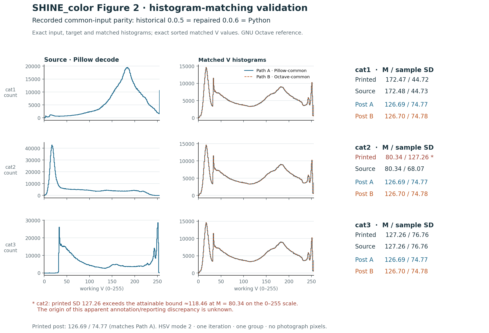

# SHINE_color_py

SHINE_color_py is an independent Python behavioral reimplementation and
modernization of SHINE_color (Dal Ben, 2023), developed to preserve the original
research workflow on current Python-based systems. It is intended as a
continuation of the original tool rather than a replacement for it.

**Lineage:** [original SHINE_color](https://github.com/RodDalBen/SHINE_color)
→ [repaired/maintained SHINE_color 0.0.6](https://github.com/cliffworkman/SHINE_color)
→ SHINE_color_py.

## Original work and contributions

**Rodrigo Dal Ben** authored SHINE_color, its color-image workflow and
publication, building on the **SHINE toolbox by Verena Willenbockel, Javid Sadr,
Daniel Fiset, Greg O. Horne, Frederic Gosselin and James W. Tanaka**.
Please cite the original work when using this continuation:

- Dal Ben, R. (2023). SHINE_color: controlling low-level properties of colorful
  images. *MethodsX, 11*, 102377. [doi:10.1016/j.mex.2023.102377](https://doi.org/10.1016/j.mex.2023.102377).
- Willenbockel, V., Sadr, J., Fiset, D., Horne, G. O., Gosselin, F., & Tanaka,
  J. W. (2010). Controlling low-level image properties: The SHINE toolbox.
  *Behavior Research Methods, 42*(3), 671–684.
  [doi:10.3758/BRM.42.3.671](https://doi.org/10.3758/BRM.42.3.671).

Original resources: [SHINE_color repository](https://github.com/RodDalBen/SHINE_color),
[OSF project](https://osf.io/auzjy/),
[SHINE website](http://www.mapageweb.umontreal.ca/gosselif/SHINE/) and
[SHINE manual](http://www.mapageweb.umontreal.ca/gosselif/shine/SHINEmanual.pdf).

**Cliff Workman's contributions** are maintenance and bug repairs in the
repaired 0.0.6 fork, followed by this independently written Python implementation,
batch research workflow, numerical validation, provenance tooling and continued
maintenance. Original toolbox authorship remains with the authors above.
Report Python implementation issues in
[this repository](https://github.com/cliffworkman/SHINE_color_py/issues).

The [original MIT license](LICENSE) and
[component notices and attribution](THIRD_PARTY_NOTICES.md) are retained.
The upstream repository-level MIT text and restrictive embedded notices coexist;
this repository records that history without claiming one overrides the other.
See [provenance and licensing](docs/PROVENANCE_AND_LICENSING.md).

Navigate: [Python use](#install-and-use-python) ·
[Figure 2 validation](#reproducing-shine_colors-published-histogram-matching-example) ·
[Python differences](#what-is-different-in-shine_color_py) ·
[validation evidence](#validation-and-reproduction) ·
[complete inherited documentation](#inherited-shine_color-006-documentation).

## Install and use Python

Python 3.10 or newer is required. Install from a checkout of this repository:

```shell
git clone https://github.com/cliffworkman/SHINE_color_py.git
cd SHINE_color_py
python -m pip install -e ".[dev]"
python -m pytest -q -p no:cacheprovider
```

The install name is `shine-color`; the import name is `shine_color`.
This is a source-checkout workflow, not a PyPI release announcement.
Runtime dependencies are NumPy and Pillow; SciPy and pytest support validation.

```python
from shine_color.batch import process_directory

# Example settings: choose the mode and normalization group for your study.
result = process_directory(
    "stimuli", "normalized", colorspace="HSV", mode=2,
    iterations=1, rescale_option=1,
)
print(result.output_paths)
print(result.manifest_path)
```

Supply at least two same-size images as **one normalization group**: targets
depend on the group. No resizing, cropping or upscaling is performed.
HSV processes working V, CIELab processes working L*, and RGB processes each
channel independently. Mode is explicit; there is no silent mode default.

| Mode | Operations in each iteration |
| --- | --- |
| 1 | Luminance matching |
| 2 | Histogram matching |
| 3 | Rotationally averaged spatial-frequency matching |
| 4 | Full amplitude-spectrum matching |
| 5 | Histogram → spatial frequency |
| 6 | Histogram → amplitude spectrum |
| 7 | Spatial frequency → histogram |
| 8 | Amplitude spectrum → histogram |

For ordered file lists use `process_files`; for arrays use
`shine_color.pipeline.run(images, colorspace, mode, iterations=1, rescale_option=1)`.
The array API returns transformed RGB uint8 arrays. The file API writes PNGs
and a provenance manifest. See [file workflow](docs/FILE_WORKFLOW.md) for
representation rules, parameters, ordering, collision and partial-failure behavior.

## Reproducing SHINE_color's published histogram-matching example

SHINE_color_py was tested against the same three sample files used in the
original SHINE_color Figure 2 example. To separate JPEG-decoder effects from
algorithmic behavior, historical SHINE_color 0.0.5, repaired 0.0.6 and Python
were also given identical decoded RGB arrays. On common decoded input they
produce identical 256-bin input histograms, target histograms, matched
histograms and sorted matched Value-channel outputs in the recorded audit.
The 0.0.6 follow-up rechecked those archived Octave results; it did not run a
fresh Octave comparison. Raw RGB identity is not claimed: histogram tie
assignment is stochastic. With Pillow-decoded inputs, matched outputs give
M = 126.69 and SD = 74.77, reproducing Figure 2's displayed post-match values.



| Image | Figure 2 baseline | Supplied source | Post-match |
| --- | --- | --- | --- |
| cat1 | 172.47 / 44.72 | 172.48 / 44.73 | 126.69 / 74.77 |
| cat2 | 80.34 / 127.26 | 80.34 / 68.07 | 126.69 / 74.77 |
| cat3 | 127.26 / 76.76 | 127.26 / 76.76 | 126.69 / 74.77 |

Values are mean / sample SD of working HSV V on the 0–255 scale. Source values
are Pillow-decoded and rounded to two decimals; the post-match column is the
Pillow-common path. Exact common-input histogram and sorted-value
parity is the comparison contract. Figure 2's cat2 baseline reports M = 80.34,
SD = 127.26, while the supplied image reproduces the mean but not that SD.
At this mean, SD 127.26 exceeds the attainable bound of approximately 118.46
for 0–255 data. The origin of this apparent annotation/reporting discrepancy
is unknown. This SD is not used as a software golden. Cat1's calculated values
correspond to the displayed values if truncated to two decimals, a plausible
formatting explanation rather than an established reporting convention.
JPEG-decoder differences also affect decoded pixels: the Octave-common path
rounds to post M = 126.70, SD = 74.78. These display-level differences do not
change the common-input algorithmic comparison.

See the [detailed Figure 2 audit](docs/FIGURE2_REPRODUCTION.md) and
[provenance/licensing record](docs/PROVENANCE_AND_LICENSING.md).

## What is different in SHINE_color_py?

The scientific method and research lineage remain SHINE_color. This version adds:

- Python packaging and a NumPy numerical kernel, using NumPy/pocketfft as the
  production FFT backend; pyFFTW is optional diagnostic tooling only.
- Explicit GNU Octave-compatible numeric and HSV/Lab conversion contracts.
  GNU Octave is the executable validation reference; exact MATLAB numerical
  parity remains untested. The inherited MATLAB instructions below describe
  that implementation's reference policy, not a Python parity claim.
- Repaired 0.0.6 stage chaining and iteration semantics: every stage consumes
  its predecessor's output, including across iterations.
- File and batch APIs with ordered groups, collision protection, source/pixel
  hashes, parameters and decoder versions recorded in JSON manifests.
- PNG/JPEG input through Pillow, EXIF orientation normalization, and lossless
  RGB PNG output. Transparency and high-bit-depth input are rejected. No hidden
  ICC/gamma transformation is applied. JPEG decoder dependence is documented.
- Automated regression tests and deterministic or captured-reference fixtures
  where appropriate. Histogram tie assignment remains stochastic; degenerate
  spectra have explicit backend-sensitive tests rather than widened tolerances.

Current scope is whole-image processing. Masking/foreground-background separation,
SSIM-optimized histogram matching, the interactive wizard, video, GUI, upscaling
and full original diagnostic-plot/SSIM workflows are not implemented. This is
not a claim of full feature equivalence. The `reference` extra retains
scikit-image 0.25.2 only for historical converter comparisons.

## Validation and reproduction

The current pinned checkpoint passes **1,535 tests** under Python 3.12.10,
NumPy 2.1.3, SciPy 1.15.1 and Pillow 10.4.0. Validation is bounded to the
recorded corpora and environments; it does not promise universal FFT or decoder
identity. The scientific implementation and numerical fixtures were unchanged
for this public documentation checkpoint.

Both frequency operations match 162 independently screened synthetic/photo
outputs exactly. All 102,193 validated working L/V values and tested uint8
reconstructions agree exactly. All 480 whole-image configurations meet the
documented contract: 478 strict deterministic/captured-histogram replays and
two positive dynamic spectral-degeneracy cases with exact common-forward replay.
HSV terminal outputs are exact throughout the recorded pipeline corpus.

- [Validation overview](docs/VALIDATION.md), [FFT policy](docs/FFT_BACKEND_POLICY.md),
  [FFT investigation](docs/FFT_DIAGNOSTICS.md), [nonfinite rescaling](docs/NONFINITE_RESCALE.md).
- [Color adapters](docs/COLOR_ADAPTER_VALIDATION.md), [HSV adapter](docs/HSV_ADAPTER_VALIDATION.md),
  [pipeline](docs/PIPELINE_VALIDATION.md), [file workflow](docs/FILE_WORKFLOW.md).
- [Figure 2 reproduction](docs/FIGURE2_REPRODUCTION.md),
  [provenance and licensing](docs/PROVENANCE_AND_LICENSING.md),
  [external Octave fixture reproduction](reference/octave/README.md).

## Inherited SHINE_color 0.0.6 documentation

The inherited repaired-fork README snapshot below was taken at commit
`7074df49bf42d622f2ea30c3a838629eada6b787`, which contains the complete
0.0.6 release and Figure 2 validation documentation. That snapshot is now part
of the fork's final merged `main` history at
`1421d6b24754e37cde47a3e94867828dfba4562e`. The fork's later, fork-specific
Codex provenance disclosure is not duplicated inside this inherited block;
SHINE_color_py records its own Codex-assisted development provenance below.
Scientific descriptions, original contact, references, all release notes and
the fork's validation note are preserved. Statements about MATLAB, the wizard,
video and filesystem side effects refer to the original/repaired MATLAB toolbox.
Adjacent **Python equivalent** notes distinguish this implementation. The
historical Figure 2 note is [retained locally](docs/FIGURE2_VALIDATION.md) so its
link still works. The inherited citation's spelling “MethodX” is retained
verbatim; the formatted citation above uses the journal name *MethodsX*.

<!-- BEGIN inherited README: SHINE_color 7074df49bf42d622f2ea30c3a838629eada6b787 -->
## SHINE_color

See release notes below. Please, send suggestions and doubts to <dalbenwork@gmail.com>

***

`SHINE_color` was adapted from the `SHINE` toolbox and allows the control of low-level properties of colorful images. It does so by either manipulating RGB channels directly or by converting RGB into HSV or CIELab color space, extracting the luminance channel, applying `SHINE` controls, and concatenating it with the other channels (i.e., Hue, Saturation) to create a colorful image with controlled luminance.

> **This is a maintained fork** of the published [SHINE_color toolbox](https://github.com/RodDalBen/SHINE_color) (Dal Ben, 2021, adapted from Willenbockel et al., 2010; see the citation below). It preserves the original methods and workflow. Version 0.0.6 repairs a set of implementation defects identified in version 0.0.5, restoring behavior that the published documentation clearly intended but that the code did not consistently produce. These fixes are intentionally narrow: the goal is to restore documented/intended behavior, not to redesign the image-normalization algorithms, mode definitions, or processing order. A regression test suite was added alongside the fixes to make the repaired behaviors explicit and guard against silent regressions. See the version 0.0.6 entry in the update history below for details.

`SHINE` documentation (see a [manual here](http://www.mapageweb.umontreal.ca/gosselif/shine/SHINEmanual.pdf)) extends to `SHINE_color`. See a step-by-step on how to use `SHINE_color` following.

#### REQUIREMENTS

<!-- BEGIN Python equivalent -->
> **Python equivalent:** install NumPy/Pillow and this package as shown in
> [Python use](#install-and-use-python). MATLAB, Octave and their packages are
> needed only to regenerate external reference evidence, not to run Python.

<!-- END Python equivalent -->

`SHINE_color` requires either:
- **MATLAB** with the **Image Processing Toolbox** (used for `rgb2lab`, `lab2rgb`, `imhist`, `mean2`, `std2`, `fspecial`, and `medfilt2`), or
- **GNU Octave** with the **`image`** package (`pkg install -forge image` if not already installed; `SHINE_color` loads it automatically). Octave support is a secondary compatibility property, not the primary target: MATLAB remains the reference environment for exact numerical behavior, and small MATLAB-vs-Octave differences (e.g. in color-space conversion) are expected and not bugs. One known gap: `SHINE_color`'s Command Window log header uses MATLAB's `datetime`, which under Octave requires the separate `datatypes` package (`pkg install -forge datatypes`) to be installed and loaded.

`SHINE_color` will now fail immediately with a clear message if this dependency isn't available, rather than partway through a run.

**Path note:** `toolbox/rescale.m` is a SHINE_color-specific function (rescales a *cell* of images) that intentionally shares its name with MATLAB's built-in `rescale` (a different function, added in R2017b, that rescales a single numeric array). Once the `toolbox/` folder is on your path, `toolbox/rescale.m` is used by `sfMatch`/`specMatch` as intended; if you have another, unrelated `rescale.m` earlier on your path, `SHINE_color` now warns about it at startup.

#### STEP-BY-STEP

<!-- BEGIN Python equivalent -->
> **Python equivalent:** use `process_directory` or `process_files` with an
> explicit colorspace, mode and group; results and a manifest go to the output
> directory you supply. See [file workflow](docs/FILE_WORKFLOW.md). There is no
> wizard or video path. Python rejects alpha-bearing PNGs and does not perform
> separate foreground/background manipulation.

<!-- END Python equivalent -->

If you have no experience with MATLAB, just follow these steps (images available on the files tab of the [OSF project](https://osf.io/auzjy/)):

1. Download/clone the `SHINE_color` & unzip it on the desired folder;
2. Go into the SHINE_color/toolbox subfolder;
3. Add the images/videos to be processed in the "SHINE_color_INPUT" folder;
4. Open MATLAB and select the "SHINE_color" folder, then the "SHINE_color/toolbox" subfolder;
5. Type "SHINE_color" (case sensitive);
6. Follow the prompts and select the operations you would like;
7. Once it is done (the sign ">>" is back on the editor), check the "SHINE_color_OUTPUT" folder. There you will find your processed images/videos and some statistics. Also check the input folder for pre-processing statistics.

Please note that `SHINE_color` does not read transparent (alpha) channels from .PNG images. If you want to display images with transparent background on your experiment, upload them to `SHINE_color`, perform manipulations on background and foreground separately, then remove the background on an image manipulation software (e.g., GIMP, Photoshop).

#### MODES, ITERATIONS & RETURN VALUES

<!-- BEGIN Python equivalent -->
> **Python equivalent:** modes 5–8 and successive iterations chain the prior
> result. `pipeline.run` returns RGB arrays without filesystem side effects;
> the batch APIs save RGB PNGs and return a `BatchResult` including manifest
> paths. Mode and iteration count are explicit arguments; there is no diary
> or automatic MATLAB-style diagnostics folder.

<!-- END Python equivalent -->

- **Modes 5-8** (the combined modes: `histMatch & sfMatch`, `histMatch & specMatch`, `sfMatch & histMatch`, `specMatch & histMatch` -- mode 8 is the default) genuinely apply their first operation, then apply their second operation to that result.
- **Iterations**: the "# of iterations?" prompt (available for the combined modes) is honored -- iteration *N* is applied to iteration *N-1*'s result, not recomputed from the original images each time.
- **Return value**: `SHINE_color` can be used either as a script (no output captured -- e.g. typing `SHINE_color`) or as a function (`out = SHINE_color(inputpath,outputpath,extension,cs,im_vid,plots)`). With no captured output, reconstructed transformed image files are written to the selected/caller-supplied output folder, as before. With a captured output, `out` contains the reconstructed transformed images, and those transformed image files are not written to `output_folder`. In both cases, `SHINE_color`'s other existing filesystem side effects are unchanged: the Command Window log (`diary`) and `lumCalc`'s luminance statistics (and diagnostic plots, if requested) are still written under `SHINE_color_OUTPUT`/`SHINE_color_OUTPUT/DIAGNOSTICS` regardless of whether a return value is captured. Pick whichever calling style suits your workflow, but note that command-line calls only expose `inputpath`, `outputpath`, `extension`, `cs`, `im_vid`, and `plots`; matching mode, region, background, SSIM optimization, and iteration count remain fixed at their script defaults (mode 8, whole image, automatic background, no SSIM optimization, 1 iteration) unless you go through the interactive wizard.

***

References
Dal Ben, R. (2023). SHINE_color: controlling low-level properties of colorful images. MethodX, 11, 102377. https://doi.org/10.1016/j.mex.2023.102377

Willenbockel, V., Sadr, J., Fiset, D., Horne, G. O., Gosselin, F., & Tanaka, J. W. (2010). Controlling low-level image properties: The SHINE toolbox. Behavior Research Methods, 42(3), 671–684. http://doi.org/10.3758/BRM.42.3.671
SHINE toolbox is available at: http://www.mapageweb.umontreal.ca/gosselif/SHINE/

***

Update, September 2026, version 0.0.6

Bug-fix and validation release. This maintained-fork release repairs implementation defects identified in version 0.0.5, without changing the published SHINE_color algorithms, mode definitions, or processing order.

Repairs:
- Fix combined processing modes 5-8 so the second operation consumes the first operation's result rather than independently reprocessing the original channel;
- Fix propagation of the user-selected iteration count from the interactive wizard;
- Fix iterative processing so iteration N consumes iteration N-1's output rather than repeatedly reprocessing the source;
- Fix automatic foreground/background separation so automatic background intensity is based on the modal image intensity rather than the upper-left pixel;
- Fix captured function output so `SHINE_color(...)` returns reconstructed transformed images rather than empty cells;
- Fix RMSE/SSIM calculation when a function return value is captured;
- Fix HSV and CIELab RMSE/SSIM comparisons so both operands use the same SHINE internal 0-255 scale;
- Add MATLAB Image Processing Toolbox / GNU Octave `image` package dependency checks;
- Add a targeted warning for conflicting `rescale.m` path resolution;
- Add the MATLAB/GNU Octave-compatible regression suite;
- Document current command-line limitations, iteration behavior, return-value behavior, and Octave compatibility.

Validation: all six regression test groups passed repeatedly under GNU Octave 11.1.0 on the repaired implementation, and those same six groups failed when exercised against a scratch copy restored to the corresponding pre-fix behavior. MATLAB R2024a was installed on the validation machine, but automated test execution could not be completed because the license server was unreachable (License Manager Error -15); exact MATLAB/Octave numerical equivalence has not been independently confirmed.

No SHINE_color image-normalization algorithms, processing-mode definitions, or published operation ordering were intentionally changed in version 0.0.6. This release is intended to restore the behavior of the published implementation where the code contradicted its stated intent.

## Validation against the published Figure 2 example

The repaired fork was checked against the three sample files distributed with
SHINE_color and used for the published Figure 2 HSV histogram-matching example.
Their exact file identities were recorded by SHA-256. In HSV mode 2, with one
iteration and one three-image group, historical SHINE_color 0.0.5 and repaired
0.0.6 produce the same histogram-matching behavior when supplied identical
decoded RGB pixels. The common-input comparison also matches SHINE_color_py:
pre-match histograms, the target histogram, matched histograms and sorted
matched working-V values are identical in the recorded audit. The 0.0.6
follow-up rechecked archived Octave results; it did not run a fresh comparison.
The Pillow-common path reproduces Figure 2's displayed post-match values,
M = 126.69 and SD = 74.77. JPEG decoder differences can change
the decoded pixels and therefore shift summary statistics before processing.


| Image | Figure 2 baseline | Supplied source | Post-match |
| --- | --- | --- | --- |
| cat1 | 172.47 / 44.72 | 172.48 / 44.73 | 126.69 / 74.77 |
| cat2 | 80.34 / 127.26 | 80.34 / 68.07 | 126.69 / 74.77 |
| cat3 | 127.26 / 76.76 | 127.26 / 76.76 | 126.69 / 74.77 |

Values are mean / sample SD of working HSV V on the 0–255 scale. Source values
are Pillow-decoded and rounded to two decimals; the post-match column uses the
Pillow-common decoded path. Exact common-input histogram parity
is the software comparison contract. One printed baseline statistic does not
reproduce from the distributed sample image: Figure 2 reports cat2 as
M = 80.34, SD = 127.26. The supplied image reproduces the mean but not that SD,
and 127.26 is outside the attainable SD range for values bounded to 0–255 at
that mean. The origin of this apparent annotation/reporting discrepancy is
unknown, so the value is reported transparently rather than used as a software
golden. Cat1 differs from the displayed values by approximately 0.01; its
calculated values correspond to the printed values if truncated to two decimals,
a plausible formatting explanation rather than an established convention.
JPEG-decoder differences also affect decoded pixels: the Octave-common path
rounds to post M = 126.70, SD = 74.78. These display-level
differences do not affect the common-input algorithmic comparison.

See the [detailed Figure 2 validation note](docs/FIGURE2_VALIDATION.md) for
source hashes, decoder separation and comparison scope.

***

Update, April 2023, version 0.0.5

Updates & improvements:
- Functional command line call, input is read by readImages;
- Streamline readImages.m
- Streamline lum2scale.m;
- Remove image reading and preprocessing from individual functions;
- Streamline comments, descriptions, and standardize function naming;
- Add license info to main script;
- Add Command Window log (diary);
- Add message redirecting users to SHINE in case of greyscale input;
- Make main script modular, added:
-- displayInfo.m;
-- processImage.m;
-- userWizard.m;
- Add RGB colorspace:
-- RGB added as a cs option (SHINE_color);
-- Transformations applied to each RGB channel;
-- diagPlots on each RGB channel;
-- lumCalc on each RGB channel;
-- Provide RMSE and SSIM to each RGB channel;

***

Update, October 2021, version 0.0.4

Updates & improvements:
- `lum_calc` is calculated directly from the input and output luminance channel. Previous versions re-read rgb images, transformed it to hsv or CIELab, and then calculated statistics. The new function is more accurate and faster;
- `diag_plots` plots luminance information directly from the input and output luminance channel. The previous versions re-read rgb images, transformed it to hsv or CIELab, and then plotted the luminance information. The new function is more accurate and faster.

***

Update, September 2021, version 0.0.3

Updates & improvements:
- Require input to every prompt (except for prompts with default values);
- When dealing with images, require at least 2 images to advance;
- Fix the pooled SD calculation from `lum_calc`;
- Update `lum_calc` output, now with pre vs. pos summary in a single file;
- Add option for CIELab colorspace;
- Update functions' input to account for new colorspace (e.g., `sfPlot`, `spectrumPlot`);
- `v2scale` is now `lum2scale`;
- `scale2v` is now `scale2lum`;
- Add `DIAGNOSTICS` subfolder in `SHINE_color_OUTPUT`, for storing img stats and diag plots;
- Add a new function `diag_plots` for diagnostic plots of operations with images.

***

Update, April 2019, version 0.0.2

The new version of the `SHINE_color` now handles video files. If a video file is provided, all frames will be extracted, `SHINE_color` operations will be performed on each frame, and the video will be re-created with the manipulated frames.

***
<!-- END inherited README -->

## Built with AI assistance

SHINE_color_py was developed with substantial AI-coding assistance from
OpenAI Codex. Codex contributed to implementation, inspection and repair,
test construction, numerical investigations, reference comparisons,
provenance audits, and documentation.

Cliff Workman directed and reviewed the work. These contributions were treated
as hypotheses to be checked, not as a source of truth. Scientific and numerical
claims were independently evaluated against the historical SHINE_color
implementation, the repaired 0.0.6 fork, recorded GNU Octave reference outputs,
mathematical contracts, and the published Figure 2 example. In the validated
environment, the project passes 1,535 tests. The Figure 2 audit establishes
exact common-input histogram parity between Python and the recorded historical
and repaired toolbox results under GNU Octave; the repaired confirmation
rechecked archived results rather than running a fresh Octave comparison.

This disclosure records how Cliff Workman's Python continuation was built
and verified. Original SHINE_color and SHINE authorship, and authorship of
Dal Ben (2023), remain separate and unchanged. Codex provided AI-coding
assistance, not original authorship, independent maintenance, scientific
decision-making, or copyright ownership. Recording that substantial assistance
makes the development process inspectable alongside its validation.